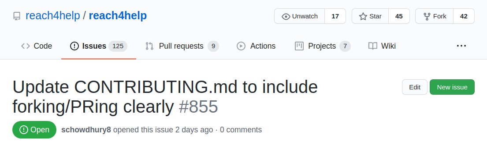

# Contributing to Reach4Help

🎉🚀🙌🏻 Thanks for taking the time to contribute to the project! It's people like you that make Open Source so great. 🙌🏻🚀🎉

### Please read our [**Code of Conduct**](CODE_OF_CONDUCT.md) before starting.
Following these respects the time of everyone managing and developing this project. In return, they should reciprocate that respect in addressing your issue, assessing changes, and helping you finalize your pull requests. 

## Table of Contents
- [Getting set up](#getting-set-up)
- [Making your first contribution](#making-your-first-contribution)
- [Coding Conventions](#coding-conventions)
- [Code review process](#code-review-process)
- [Tech Stack](#tech-stack)
- [Troubleshooting](#troubleshooting)

# Getting set up
### Method 1: Clone directly
- Clone using https://github.com/reach4help/reach4help.git
- Ask for permission to the repo from @ashwinkjoseph

### Method 2: Clone your fork and set the remote upstream
If you don't yet have access this repo,  you will have to use this method. 
- Fork the repo and clone it to your local machine. 
- Set the remote upstream: `git remote add upstream https://github.com/reach4help/reach4help.git`
- Make sure you are correctly pointing to your fork and to the upstream branch: `git remote -v`
- Check [GitHub's own docs](https://docs.github.com/en/github/collaborating-with-issues-and-pull-requests/configuring-a-remote-for-a-fork) for more info.   

## Install `node` and `yarn` if not already done
- [Download Node Here](https://nodejs.org/en/download/ 'Download Node Here')
- [Download Yarn Here](https://yarnpkg.com/lang/en/docs/install/ 'Download Yarn Here')

#### In this repo we favour `yarn` over `npm` as the "official" package manager since we also leverage `yarn workspaces` as the manager for our `monorepo`

## Setting up the environment variables (in web-client folder)
Windows: `copy .env.EXAMPLE .env`
Unix/Mac: `cp .env.EXAMPLE .env`

## Run the project
1 - Install dependencies automatically using yarn by typing:
```
yarn
```

2 - Run the `web-client` project in development mode.
```
cd ./web-client && yarn start
```

3 - The client is now available under [localhost:3000](http://localhost:3000)
If you have problems because of API keys, see [Troubleshooting](#Troubleshooting) at the end of this document.

# Making your first contribution
## Creating a branch
- All branches must be based off of upstream/development
- Before you do any work you must:
  - `git fetch --all`
  - `git checkout upstream/development`

## Naming a branch
- The branch name must tell us
  - The kind of issue it resolves
  - The number of the issue on github
  - A description of the issue.

### Example


The branch for this is named

- documentation/855-forking-pr-instructions
- Note that "#" is not put before 855, as "#" is a special character in HTML.

## Before you commit
- Always fix your linting errors
  - within the web-client directory (not the top directory!!!)
  - Run `yarn lint` and fix the errors manually
  - Ran `yarn lint:fix` and let the linter fix them for you
- Before you commit anything, always always always merge with upstream development
  - `git merge upstream/development`

## Commit and pull request
- `git commit -m "message"`
- `git push`
- Git will give you instructions on how to push a new branch. Follow them.
  - eg: `git push --set-upstream origin documentation/855-forking-pr-instructions`
- Go to GitHub and create a Pull Request against reach4help/development
- Assign people to review and approve your pull request

Note: Opening pull requests should be done with enough information and screenshots for visual changes to facilitate the reviewers job. It's MANDATORY to add a link to the issue related. 

> Working on your first Pull Request? You can learn how from this _free_ series, [How to Contribute to an Open Source Project on GitHub](https://egghead.io/series/how-to-contribute-to-an-open-source-project-on-github).

Feel free to ask for help; everyone is a beginner at first :smile_cat: 

# Coding conventions
## Naming, Declaring items and Where to declare items
You must refer to this document for understanding the conventions followed in this project for naming and the order in which declarations have to be made.
[web-client Coding Conventions](/web-client/docs/CodingConventions/NAMING_AND_DECLARATION_CONVENTIONS.md)

## Commit message conventions
We follow the conventional commits guidelines. Check [here](https://www.conventionalcommits.org/en/v1.0.0/)

## Code Style Enforced by Prettier
Prettier guarantees the code style adopted and runs on commit, stick to this code style.
[Prettier site for more information](https://prettier.io/ 'Prettier site for more information')

# Code review process
### For your contribution to get accepted after it’s been submitted.
The core team looks at Pull Requests on a regular basis. After feedback has been given we expect responses within two weeks. After two weeks we may close the pull request if it isn't showing any activity.

# Tech Stack
- Development Platform: [ReactJS](https://reactjs.org)
- Database: [Firestore](https://firebase.google.com/docs/firestore)
- Authentication, Storage: [Firebase](https://firebase.google.com/)
- Search: [Algolia](https://www.algolia.com/)

## React, Typescript and Functional Components
### We are on the [latest version of React](https://reactjs.org/versions).
- We favour functional components and hooks to class components.
- We also prefer multiple small components to a big one
- We are leveraging `TypeScript`
- We use `styled-components` for styling
- We use Prettier and ESLint to maintain consistent code

## Application Breakdown (Modules, Pages, Routes, Ducks)
### Module Pages Routes (WIP)
### Ducks (WIP)

# Troubleshooting
## If API keys not work

This Project uses Services that require API keys and environment variables such as Firebase and Google Maps API.
The environment variables should be set up in a file named `.env` outside the `src` directory.

Unfortunately, we cannot provide the values for any of the keys that we use internally as it's linked to our billing account.
We have however, included the keys for a starter project in [`.env.EXAMPLE`](https://github.com/reach4help/reach4help/blob/development/web-client/.env.EXAMPLE). For now, you can go ahead and rename this file to `.env` to get started on development right away.

For development purposes, we have also stubbed the response from the Google Maps Geocoding API so you don't need to obtain a Google Maps API Key with a billing account associated with it. Note that this produces a fixed location response (which shouldn't hinder your development).

We use the following data services in our stack.  The keys from .env.EXAMPLE should work, but if they don't, please reach out to the core team or feel free to generate the credentials on your own:

- [Firebase](https://firebase.google.com/)
  - Enable sign-in through Facebook (with your own Facebook app that you can make [here](https://developers.facebook.com/))
  - Enable sign-in through phone
  - Enable Cloud Firestore
  - Enable Cloud Messaging
- [Google Maps API](https://developers.google.com/maps/documentation) (_optional: for dynamic geolocation_)
  - [Get a Maps JavaScript API Key](https://developers.google.com/maps/documentation/javascript/get-api-key)
  - [Get a Geocoding API Key](https://developers.google.com/maps/documentation/geocoding/get-api-key)

**NOTE:** If you are using the test credentials we provided, we had to enable `https` on localhost development server to let the live Facebook app authenticate. You'll likely see a warning from your browser about the authenticity our self-signed SSL certificate but this shouldn't cause any problems until production. For now, you can bypass the warning and proceed to start development.
