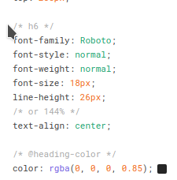
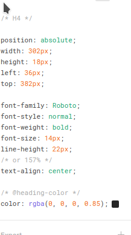

## Code Conventions

## ORDER OF CODE

- All important declarations must be made on the first screen
- - You should not have to scroll down
- - In publishing this is called "ABOVE THE FOLD", like the first page of a newspaper.

## CORRECT ORDER OF FILE:

1. Imports
2. Simple Consts
3. Main Component Declaration
4. Complex Consts
5. Styled-Components

## BlogPost.tsx

import React from 'react';

import { Typography } from 'antd';

import styled from 'styled-components';

/_ Simple Consts _/

const { Text } = Typography;

/_ Component Declaration _/

const BlogPost: React.FC< BlogPostProps > = ({ title, description }) => (

< BlogPostWrapper >

< Title >{title}< /Title >

< Description >{description}< /Description >

< /BlogPostWrapper >

);

/_ styled-component declarations _/

const BlogPostWrapper = styled.div"margin: 5px;";

const Title = styled.div"font-size: 125%;";

const Description = styled.div"font-style: italic;";

/_ Complex consts -- documentation coming soon_/

/_ interface declaration -- do not use PropTypes _/

interface BlogPostProps {

title: string;

description: string;

}

export default BlogPost;

## Constant Consts:  Function Closures

- Function closure imposes some limits on how far down we can place certain declarations. 
- - If the declaration uses a variable which is defined within the scope of the MainComponent, you have a function closure issue. 
- - Typescript complains "you can not use < SYMBOL_NAME > before it is declared"
- - Put all secondary declarations as low as possible
- - Perhaps tell the linter to ignore this error
- - -  I believe this is:
- - -   // eslint-disable-next-line @typescript-eslint/no-use-before-define
- - - or
- - -   // eslint-disable-next-line @typescript-eslint/no-use-before-declare

## Try to parameterize declarations rather than relying on function closures

BAD:

import react;

const ClosureDiv = () => {

 const innerVariable = "foo";

 const InnerFunctionOrComponent = () => < div >{innerVariable}< /div >

  return < InnerFunctionOrComponent / >
  
 }

}

GOOD: 

import react;

const ClosureDiv = () => {

 const innerVariable = "foo";

  return < InnerFunctionOrComponent >{innerVariable}< / InnerFunctionOrComponent >
  
 }}

 const InnerFunctionOrComponent = (text) => < div >text< /div >

## NAMING

- All Component Names follow standard OO Naming conventions

- - Inheritance Relationships can be indicated by appending the name of the subclass
- - All styled-components must have meaningful names that indicate their usage within the markup.
- - They must be treated exactly the same as React Components
- - The root styled-component for the module is {ModuleName}Wrapper
- - -  Never use the suffix "Container" or "Component" for a styled component.  That is the name of the file export.  Always use the suffix "Wrapper"
- - Never use a generic name that will clash with AntD components
- - https://blog.elpassion.com/naming-101-quick-guide-on-how-to-name-things-a9bcbfd02f02
- - All css must occur in styled-components

---

## Template Strings

- When you are in vscode, you see the path to the string in en.json. This path should match the actual filepath where the string is used and should have a final name that corresponds to the meaning and usage of the string.

NOTE:  This screenshot is not exactly right.  The path of the string should correspond to the path of the file.

## Generic Components in Figma

Check Figma for styles -- it already has styles in it.  We need to create a generic component library in src/components/figma

What should we name this style?  Is it really an H6?  What is a good name for t?

Be careful because figma is not always consistent in its usage of H4 or H6.  for example, they may throw in a font-weight: 700.  Create a simple concise name for a reusable component

What is this one called?

src/components/figma

Distinguish

- TextStyle components (eg font-weight: 700px) are SPANS
- BlockStyle components (eg margin: 25px) are DIVS

## MainText.tsx :

import react;

import styles;

export default styled.span "font-size: 150%;"

## InfoBox.tsx :

import react;

import styles;

export default styled.div "margin: 20px;"

## index.tsx:

import MainText from './MainText'

import InfoBox from './InfoBox'

export {MainText, InfoBox}
